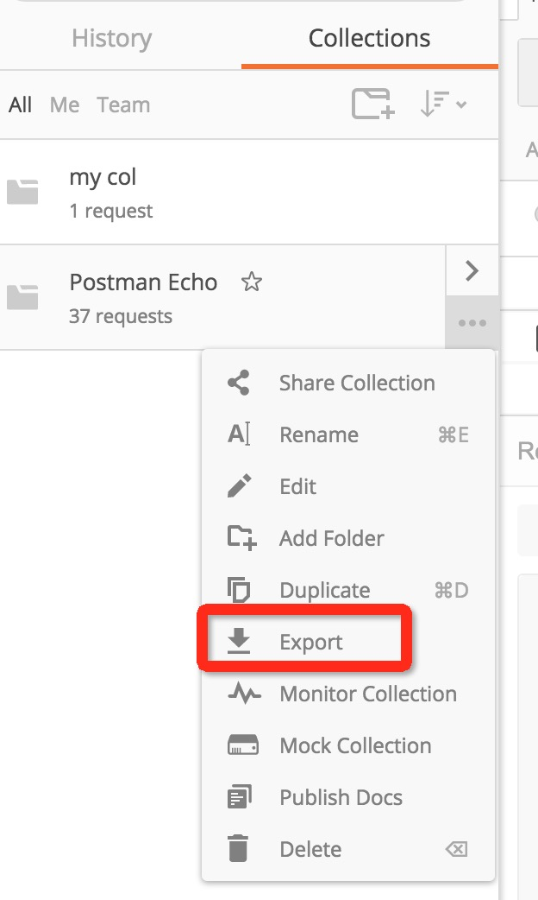
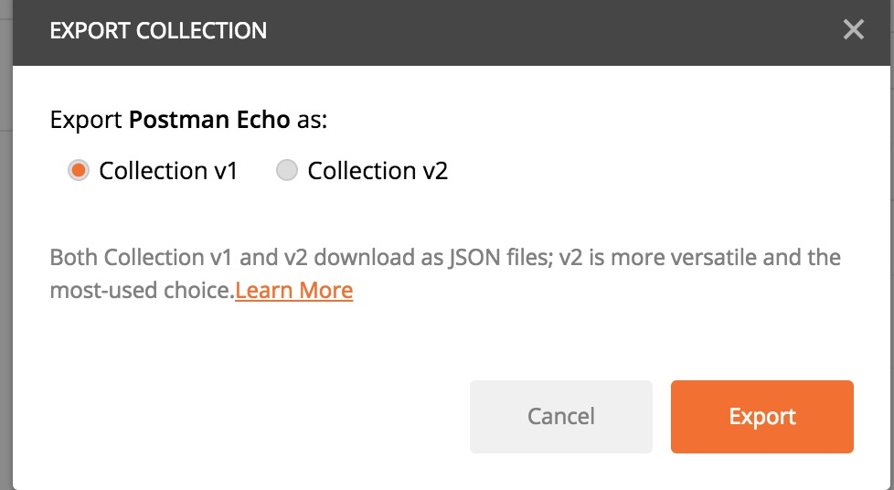
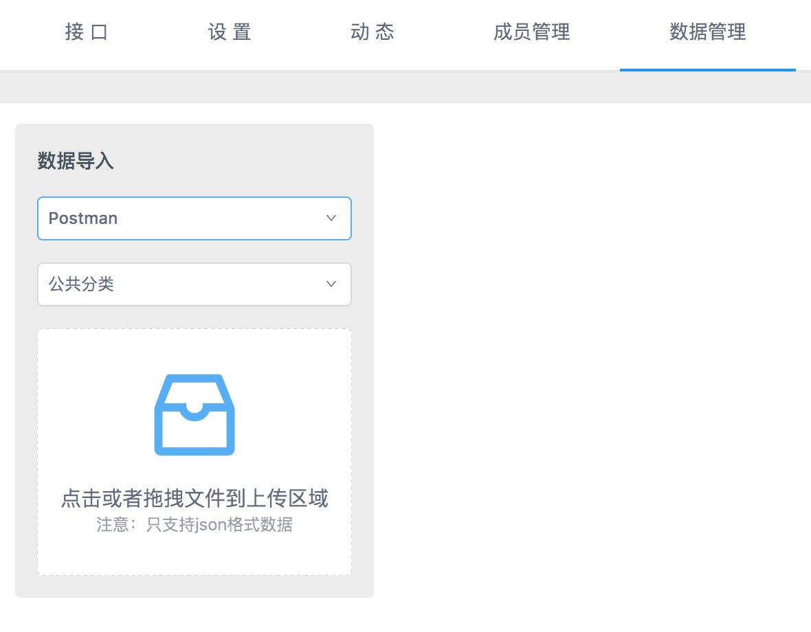
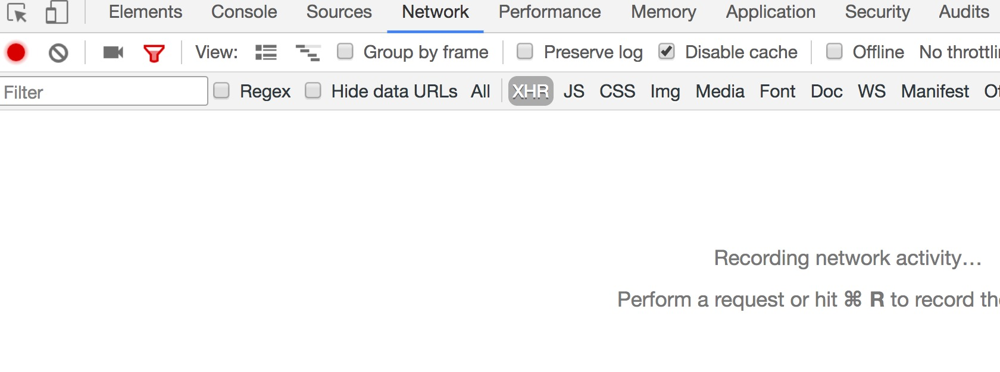
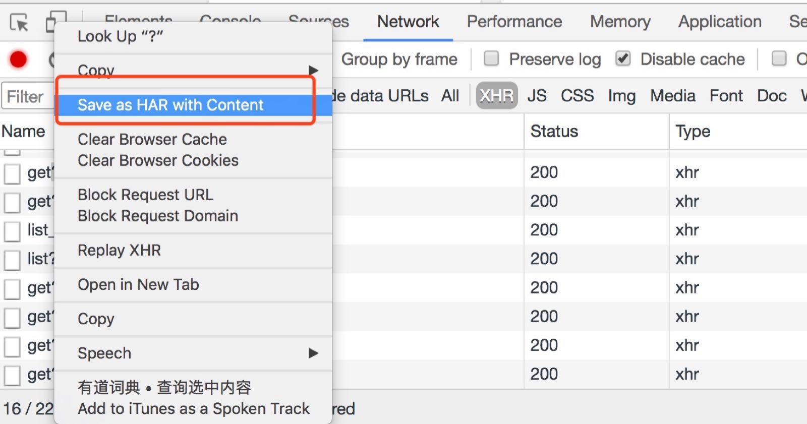
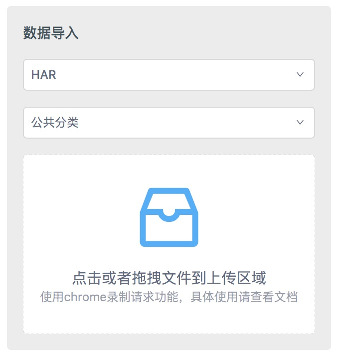
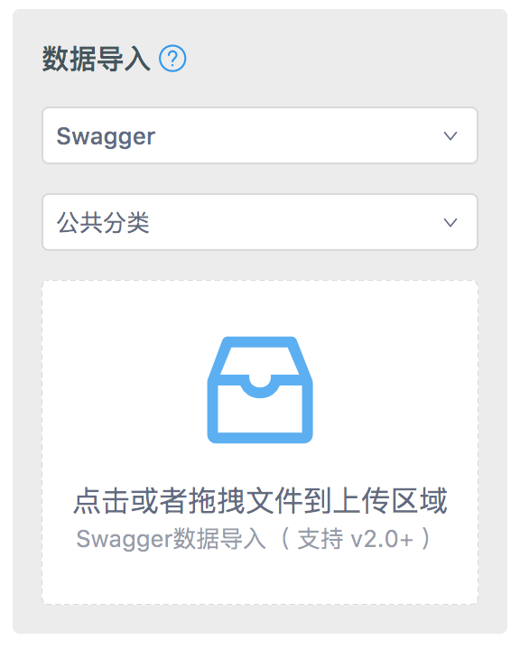
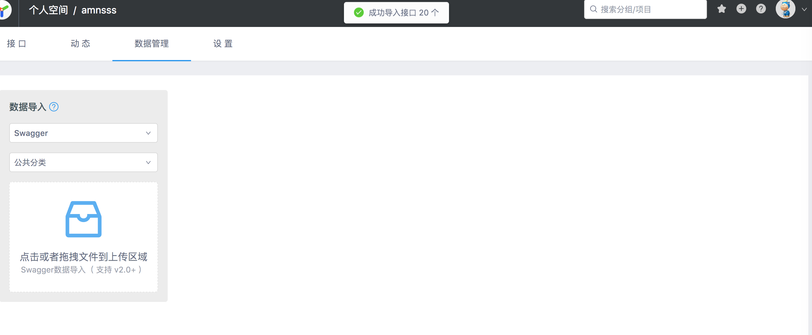
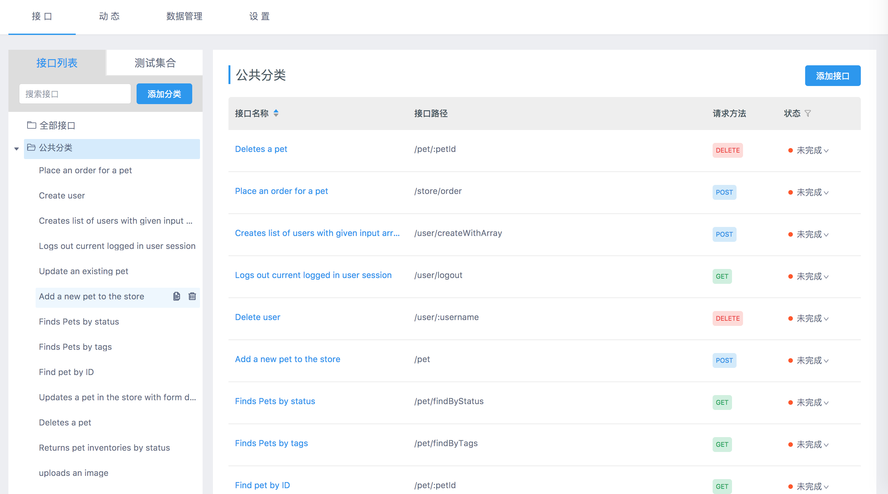
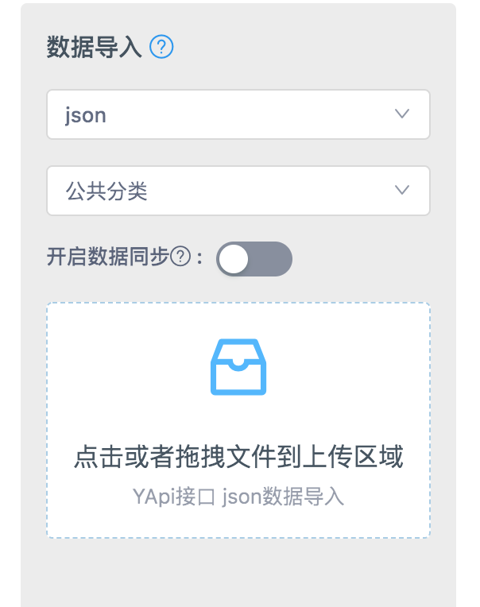

# 数据导入

在项目 **设置 → 环境与数据** 可快速导入其他格式的接口数据。YApi 目前支持 Postman、Swagger、HAR、YApi JSON 数据导入。

支持三种同步方式（`merge` / `dataSync`）：

1. **普通模式（normal）**：不导入已存在的接口
2. **智能合并（good）**：已存在接口合并返回数据的 response，保留对数据结构的改动（如 mock 字段）
3. **完全覆盖（mergin）**：不保留旧数据，完全使用新数据；默认为 normal

## Postman 数据导入

1. 在 Postman 导出接口

<div></div>

2. 选择 collection_v1，点击 export 导出到文件

<div></div>

3. 打开 YApi，进入项目 **设置 → 环境与数据**，选择 Postman 导入方式并上传文件

<div></div>

## HAR 数据导入

可用 Chrome 开发者工具录制接口数据，方便快速导入。

1. 打开 Chrome 开发者工具 → Network，首次使用先 Clear，确保录制开启（红色）

<div></div>

2. 操作页面功能后，Save as HAR with content

<div></div>

3. 在项目 **设置 → 环境与数据** 选择 HAR 导入并上传文件

<div></div>

> Tips: HAR 导入仅支持 `response.content.mimeType` 为 `application/json` 的数据

## Swagger 数据导入

[Swagger 入门](https://www.gitbook.com/book/huangwenchao/swagger/details)

1. 准备 Swagger JSON 文件（例如 [petstore 示例](http://petstore.swagger.io/v2/swagger.json)），也支持 URL 导入

2. 在项目 **设置 → 环境与数据** 选择 Swagger 导入并上传或填写 URL

<div></div>

<div></div>

<div></div>

## YApi 接口 JSON 数据导入

可导入在 YApi 平台导出的 JSON 接口数据。



## 通过开放 API 导入（自动化集成）

适用于 CI/CD 或与 Swagger 流水线配合，由后端自动生成文档后推送到 YApi。

**接口：** `POST /api/open/import_data`

**参数：**

| 字段 | 说明 |
|------|------|
| `type` | 导入类型：`swagger`、`postman`、`har`、`json` |
| `token` | 项目 Token（项目设置 → 环境与数据） |
| `project_id` | 项目 ID |
| `json` | 文件内容（与 `url` 二选一） |
| `url` | 远程 JSON 地址（与 `json` 二选一） |
| `merge` | `normal` / `good` / `mergin`，默认 `normal` |

**示例：**

```bash
curl -X POST 'http://127.0.0.1:3001/api/open/import_data' \
  -H 'Content-Type: application/json' \
  -d '{
    "type": "swagger",
    "token": "YOUR_PROJECT_TOKEN",
    "project_id": 1,
    "url": "https://petstore.swagger.io/v2/swagger.json",
    "merge": "normal"
  }'
```

将 `127.0.0.1:3001` 替换为实际 API 地址（`YAPI_PORT`）。
