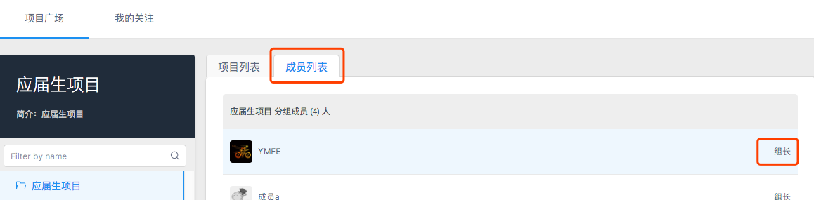
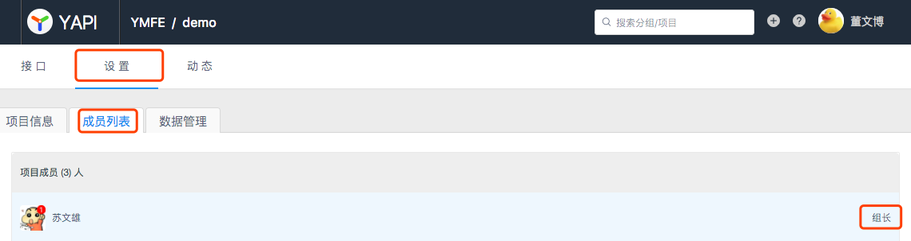

# 常见问题解答

本页面罗列使用 YApi 时的常见问题。如未找到答案，请联系管理员。

## Q1 怎样联系组长？

组长分为 **分组组长** 和 **项目组长**：

- 分组组长：首页左侧选择分组 → 右侧面板 **成员列表**，查看成员权限

- 项目组长：项目页 **设置 → 成员列表**

## Q2 怎么快速迁移旧项目？

1. 使用 Chrome 开发者工具录制接口请求
2. 导出为 HAR 文件
3. 在项目 **设置 → 环境与数据** 导入 HAR

详见 [数据导入](./data.md#har-数据导入)

## Q3 忘记密码怎么办？

请联系 **超级管理员** 重置密码。

## Q4 发现了 Bug 怎么办？

请到 [GitHub Issues](https://github.com/herper-commit/yapi/issues) 反馈。

## Q5 部署不成功怎么办？

1. Node.js >= 18（`node -v`）
2. PostgreSQL 已安装并可连接（默认 5432）
3. 已配置 `server/.env`（参考 `server/.env.example`）
4. 已手动导入 `server/db/schema.sql` 与 `server/db/seed.sql`

仍失败时，查看 API 启动日志与数据库连接配置；Docker 部署见 `deploy/docker-compose.yml` 与根目录 `README.md`。

## Q6 部署 YApi 遇到 PostgreSQL 连接问题？

检查 `YAPI_DATABASE_URL` 或 `YAPI_DB_*`（`server/.env` 或容器 `env_file`），以及数据库用户权限与 `pg_hba.conf`。
